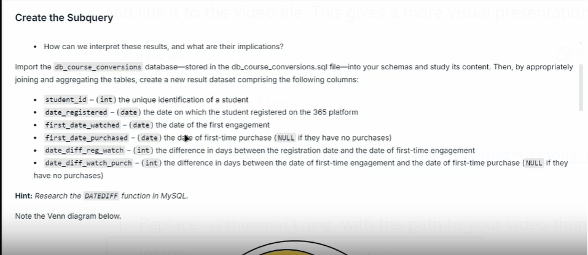

# db_course_conversions Project Documentation

## Introduction

This project analyzes student engagement and purchasing behavior using SQL queries. The database `db_course_conversions` contains tables that store information about student interactions with course content and their purchases.

## Video Instructions

[](./Instructions.mp4)

## Database Structure

### Tables

#### `student_engagement`
- `student_id` (int): The ID of the student.
- `date_watched` (date): The date the student watched the content.

#### `student_info`
- `student_id` (int): The ID of the student.
- `date_registered` (date): The date the student registered.

#### `student_purchases`
- `student_id` (int): The ID of the student.
- `date_purchased` (date): The date the student made a purchase.

## SQL Scripts

### Part 1: Retrieve Student Engagement Information

**File:** `Part1.sql`

```sql
USE db_course_conversions;

SELECT 
    e.student_id,
    i.date_registered,
    MIN(e.date_watched) AS first_date_watched,
    MIN(p.date_purchased) AS first_date_purchased,
    DATEDIFF(MIN(e.date_watched), i.date_registered) AS days_diff_reg_watch,
    DATEDIFF(MIN(p.date_purchased), MIN(e.date_watched)) AS days_diff_watch_purch
FROM
    student_engagement e
    JOIN student_info i ON e.student_id = i.student_id
    LEFT JOIN student_purchases p ON e.student_id = p.student_id
GROUP BY e.student_id
HAVING first_date_purchased IS NULL
    OR first_date_watched <= first_date_purchased;
```

### Part 2: Calculate Metrics for Student Engagement and Purchasing Behavior 

```sql
USE db_course_conversions;

SELECT 
    ROUND(COUNT(first_date_purchased) / COUNT(first_date_watched), 2) * 100 AS conversion_rate,
    ROUND(SUM(days_diff_reg_watch) / COUNT(days_diff_reg_watch), 2) AS av_reg_watch,
    ROUND(SUM(days_diff_watch_purch) / COUNT(days_diff_watch_purch), 2) AS av_watch_purch
FROM
    (
    SELECT 
        e.student_id,
        i.date_registered,
        MIN(e.date_watched) AS first_date_watched,
        MIN(p.date_purchased) AS first_date_purchased,
        DATEDIFF(MIN(e.date_watched), i.date_registered) AS days_diff_reg_watch,
        DATEDIFF(MIN(p.date_purchased), MIN(e.date_watched)) AS days_diff_watch_purch
    FROM
        student_engagement e
    JOIN student_info i ON e.student_id = i.student_id
    LEFT JOIN student_purchases p ON e.student_id = p.student_id
    GROUP BY e.student_id
    HAVING first_date_purchased IS NULL
        OR first_date_watched <= first_date_purchased) a;
```

File: ```db_course_conversions.sql```

This file contains the SQL commands to create and populate the ```db_course_conversions``` database.

```sql
-- MySQL dump 10.13  Distrib 8.0.28, for Win64 (x86_64)
--
-- Host: localhost    Database: db_course_conversions
-- ------------------------------------------------------
-- Server version	8.0.28

/*!40101 SET @OLD_CHARACTER_SET_CLIENT=@@CHARACTER_SET_CLIENT */;
/*!40101 SET @OLD_CHARACTER_SET_RESULTS=@@CHARACTER_SET_RESULTS */;
/*!40101 SET @OLD_COLLATION_CONNECTION=@@COLLATION_CONNECTION */;
/*!50503 SET NAMES utf8 */;
/*!40103 SET @OLD_TIME_ZONE=@@TIME_ZONE */;
/*!40103 SET TIME_ZONE='+00:00' */;
/*!40014 SET @OLD_UNIQUE_CHECKS=@@UNIQUE_CHECKS, UNIQUE_CHECKS=0 */;
/*!40014 SET @OLD_FOREIGN_KEY_CHECKS=@@FOREIGN_KEY_CHECKS, FOREIGN_KEY_CHECKS=0 */;
/*!40101 SET @OLD_SQL_MODE=@@SQL_MODE, SQL_MODE='NO_AUTO_VALUE_ON_ZERO' */;
/*!40111 SET @OLD_SQL_NOTES=@@SQL_NOTES, SQL_NOTES=0 */;

--
-- Table structure for table `student_engagement`
--

DROP DATABASE IF EXISTS db_course_conversions;
CREATE DATABASE db_course_conversions;
USE db_course_conversions;

DROP TABLE IF EXISTS `student_engagement`;
/*!40101 SET @saved_cs_client     = @@character_set_client */;
/*!50503 SET character_set_client = utf8mb4 */;
CREATE TABLE `student_engagement` (
  `student_id` int DEFAULT NULL,
  `date_watched` date DEFAULT NULL
) ENGINE=InnoDB DEFAULT CHARSET=utf8mb4 COLLATE=utf8mb4_0900_ai_ci;
/*!40101 SET character_set_client = @saved_cs_client */;

--
-- Dumping data for table `student_engagement`
--

LOCK TABLES `student_engagement` WRITE;
/*!40000 ALTER TABLE `student_engagement` DISABLE KEYS */;
```

### Conclusion
This project provides insights into student engagement and purchasing behavior by analyzing data from the ```db_course_conversions``` database. The SQL scripts included in this documentation help retrieve and calculate various metrics to understand student interactions better.